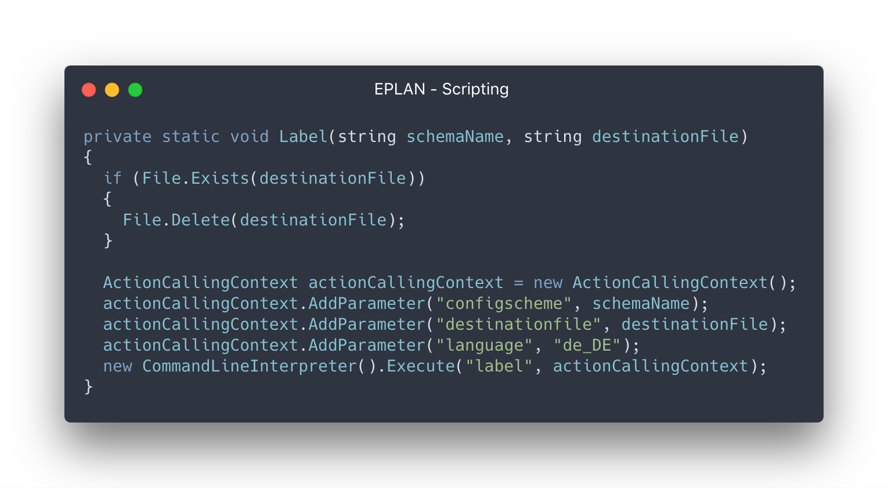
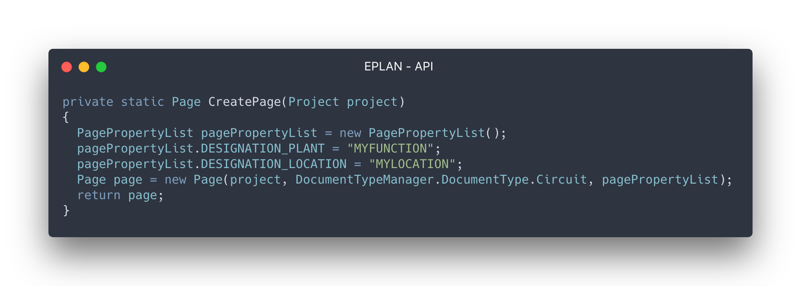
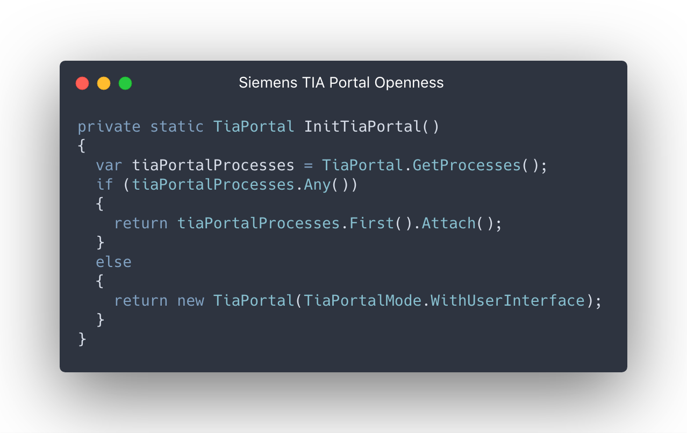

# ibKastl.ApiShowcase

## EPLAN - Scripting & API

- [Präsentation](https://github.com/ibKastl/ibKastl.ApiShowcase/blob/master/data/EPLAN/API%20Showcase%20-%20EPLAN.pptx)

- Demo
  - [Scripting](https://github.com/ibKastl/ibKastl.ApiShowcase/tree/master/src/EPLAN/ApiShowcase.EPLAN.Scripting.Demo)
  - [API](https://github.com/ibKastl/ibKastl.ApiShowcase/tree/master/src/EPLAN/ApiShowcase.EPLAN.EplAddIN.Demo)

-  Referenzen
   - [EPLAN Hilfe: Actions](http://www.eplan.help/help/platform/2.7/de-DE/help/EPLAN_help.htm#htm/availableactions_o_eplanaktionen.htm)
   - [EPLAN API Dokumentation](http://www.eplan.help/help/platformapi/2.7/en-us/help/)
   - [EPLAN Hilfe: Events](http://www.eplan.help/help/platformapi/2.7/en-us/help/API%20Events.html)
   - [Suplanus.de](https://suplanus.de/)
   - [Buch: EPLAN Electric P8 automatisieren](https://eep8a.de)

## Siemens - TIA Portal Openness

- [Präsentation](https://github.com/ibKastl/ibKastl.ApiShowcase/blob/master/data/Siemens/API%20Showcase%20-%20Siemens%20TIA%20Portal.pptx)

- [Demo](https://github.com/ibKastl/ibKastl.ApiShowcase/tree/master/src/Siemens/ApiShowcase.Siemens.Openness.Demo)

- Referenzen
  - [TIA Portal Hilfe](https://support.industry.siemens.com/cs/mdm/109477163?c=117337971723&lc=de-WW)
  - [Siemens Forum](https://support.industry.siemens.com/tf/ww/de/threads/241/)
  - [Beispiele](https://support.industry.siemens.com/cs/document/108716692/tia-portal-openness%3A-einf%C3%BChrung-und-demoanwendung?dti=0&lc=de-WW)
  - [Handbuch](https://support.industry.siemens.com/cs/document/109755218/simatic-automatisierung-von-projekten-mit-skripten?dti=0&lc=de-DE)
  - [DotNetSiemensPLCToolBoxLibrary](https://github.com/dotnetprojects/DotNetSiemensPLCToolBoxLibrary)
